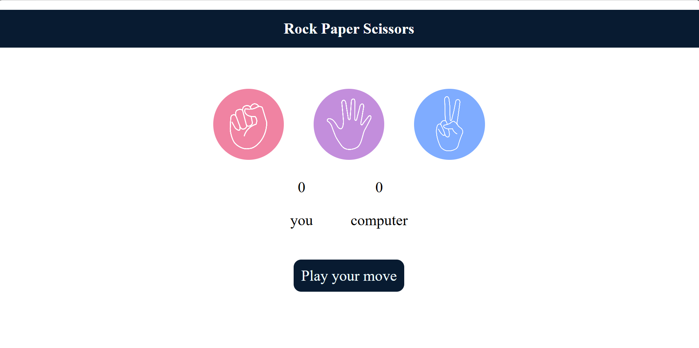

# ✊ Rock Paper Scissors Game

An interactive **Rock Paper Scissors** game built using **HTML, CSS, and JavaScript**. Challenge the computer, keep track of your score, and enjoy a simple yet engaging user interface.

---

## 📸 Project Preview



---

## 🚀 Features

* 🎮 Play Rock, Paper, or Scissors against the computer
* 🤖 Random computer move generation
* 📊 Live score tracking
* 💬 Dynamic result messages
* 🎨 Attractive and responsive UI
* ⚡ Instant game updates

---

## 🛠️ Built With

* HTML5
* CSS3
* JavaScript

---

## 📂 Project Structure

```text
Rock_Paper_Scissors/
│── index.html
│── style.css
│── app.js
│── rock.png
│── paper.png
│── scissors.png
│── screenshot.png
└── README.md
```

---

## ▶️ How to Run

1. Clone the repository:

   ```bash
   git clone https://github.com/14-Palak/rock-paper-scissors-game.git
   ```
2. Open the project folder.
3. Open `index.html` in your browser.

---

## 🎯 How to Play

* Click Rock, Paper, or Scissors.
* The computer chooses a random move.
* The winner is decided automatically.
* Scores update after every round.

---

## 👩‍💻 Author

**Palak Digarse**

GitHub: https://github.com/14-Palak
